# 🚀 Docker Exercícios

Este repositório contém exercícios praticos com imagens, containers, volumes, redes, multi-stage build e uso de Docker Compose.

---

## 📁 Exercicio-01: Imagem com Alpine

- **Objetivo**: Criar uma imagem Docker simples que imprime uma mensagem no terminal.

- **Arquivo usado**: Dockerfile

- **Comando usado**:

Criar arquivo Dockerfile
  ```dockerfile
  FROM alpine
  CMD echo "Olá, Docker!"
  ```

Criar a imagem e rodar o container
```dockerfile
docker build -t hello-docker .
docker run hello-docker
```
Saída 
<br>
<br>
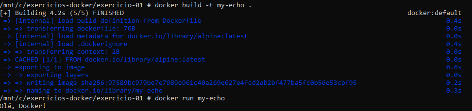
<br>
<br>

## 📁 Exercicio-02: Rodando pagina HTML com Nginx

- **Objetivo**: Rodar uma página HTML com Nginx configurando com imagem do docker.

- **Arquivos**: index.html, style.css, Dockerfile

- **Comando usado**

Criar o Dockerfile
```dockerfile
FROM nginx:alpine
COPY index.html /usr/share/nginx/html/index.html
```

Criar a imagem e rodar o container na porta 80:80
```dockerfile
docker build -t minha-landing .
docker run -d -p 80:80 minha-landing

```
Imagem criada
<br>
<br>
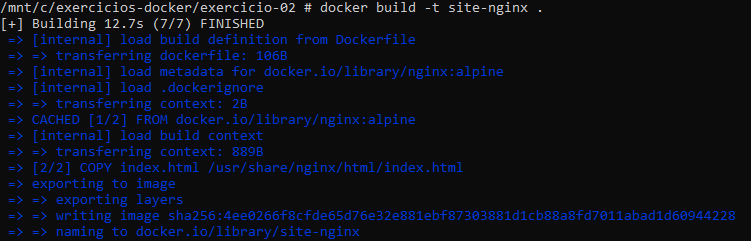
<br>
<br>
Rodando no container saída porta 80:80
<br>
<br>
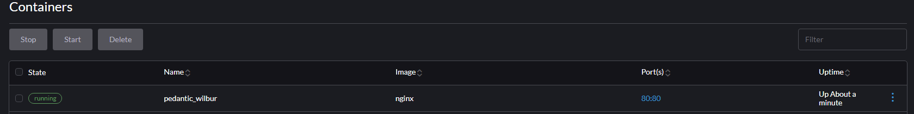
<br>
<br>
Site hospedado no nginx
<br>
<br>
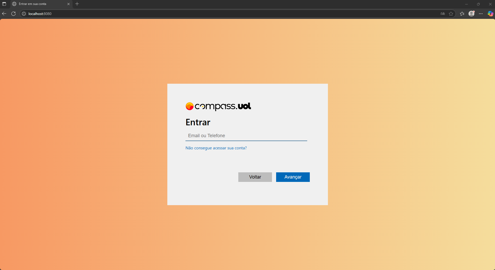
<br>
<br>

## 📁 Exercicio-03: Container com imaem ubuntu e terminal interativo

- **Objetivo**: Rodar Ubuntu no Docker e instalar pacotes interativamente.

- **Comando**:

Criar imagem dockerfile
Rodar o ubuntu
```dockerfile
docker run -it ubuntu bash
```

atualizar o sistema e baixar curl
```dockerfile
apt update
apt install curl
```

Instalando o curl dentro do ubuntu
<br>
<br>
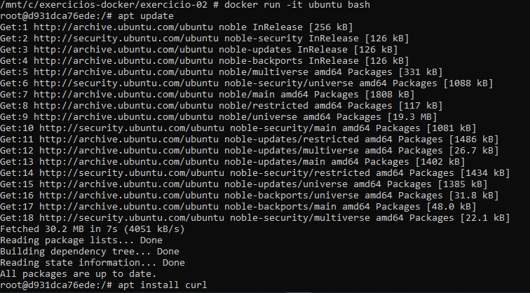
<br>
<br>

## 📁 Exercicio-04: Subir um container MySQL com volume

- **Objetivo**: Criar um volume persistente para um banco MySQL.

- **Comando**:

Criar o volume 
```dockerfile
docker volume create mysql_dados
```

Subir o container mysql
```dockerfile
docker run -d \
  --name meu-mysql \
  -e MYSQL_ROOT_PASSWORD=senha \
  -e MYSQL_DATABASE=teste \
  -v mysql_dados:/var/lib/mysql \
  mysql:5.7


```
Para executar o Banco de dados:
```dockerfile
docker exec -it meu-mysql mysql -uroot -psenha -e "SHOW DATABASES;"
```
Execução do bando de dados
<br>
<br>
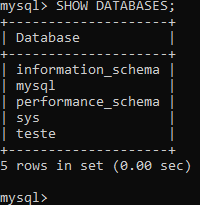
<br>
<br>

## 📁 Exercicio-05:Variáveis de Ambiente

- **Objetivo**: Passar variáveis de ambiente para o container.

- **Comando**:

faz o container rodar e cria uma variavel de ambiente
```dockerfile
docker run --rm -e MEU_NOME=Sabrina alpine sh -c 'echo $MEU_NOME'

```
Veriavel de ambiente criada com nome de usuário
<br>
<br>
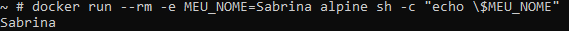
<Br>
<br>

## 📁 Exercicio-06: Multi-stage build com Go

- **Objetivo**: Compilar e executar uma aplicação Go com multi-stage build.

- **Arquivos**: main.go, Dockerfile

- **Comandos**:

Arquivo dockerfile
```dockerfile
FROM golang:1.19 AS builder
WORKDIR /app
COPY . .
RUN go build -o gs-ping
FROM alpine
COPY --from=builder /app/gs-ping .
CMD ["./gs-ping"]
```

Criar a imagem
```dockerfile
docker build -t gs-ping .
```

Excutar o container
```dockerfile
docker run --rm gs-ping
```

Saída do golang
<br>
<br>
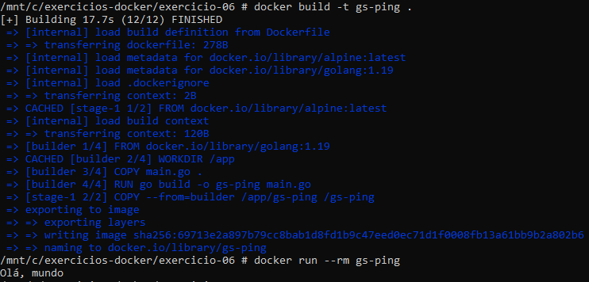
<br>
<br>

## 📁 Exercicio-07: Docker com dois containers

- **Objetivo**: Conectar containers (Node.js e MongoDB) usando Docker compose.

- **Arquivos**: Front-end + Dockerfile, Back-end + Dockerfile e Docker-compose.yml

- **Comandos**:

Criar Dockerfile do back-end
```dockerfile
# syntax=docker/dockerfile:1.4

FROM node:lts-buster-slim AS development

# Create app directory
WORKDIR /usr/src/app

COPY package.json /usr/src/app/package.json
COPY package-lock.json /usr/src/app/package-lock.json
RUN npm ci

COPY . /usr/src/app

EXPOSE 3000

CMD [ "npm", "run", "dev" ]

FROM development as dev-envs
RUN <<EOF
apt-get update
apt-get install -y --no-install-recommends git
EOF

RUN <<EOF
useradd -s /bin/bash -m vscode
groupadd docker
usermod -aG docker vscode
EOF
# install Docker tools (cli, buildx, compose)
COPY --from=gloursdocker/docker / /
CMD [ "npm", "run", "dev" ]
```

Criar Dockerfile do front-end
```dockerfile
# syntax=docker/dockerfile:1.4

# Create image based on the official Node image from dockerhub
FROM node:lts-buster AS development

# Create app directory
WORKDIR /usr/src/app

# Copy dependency definitions
COPY package.json /usr/src/app
COPY package-lock.json /usr/src/app

# Install dependecies
#RUN npm set progress=false \
#    && npm config set depth 0 \
#    && npm i install
RUN npm ci

# Get all the code needed to run the app
COPY . /usr/src/app

# Expose the port the app runs in
EXPOSE 3000

# Serve the app
CMD ["npm", "start"]

FROM development as dev-envs
RUN <<EOF
apt-get update
apt-get install -y --no-install-recommends git
EOF

RUN <<EOF
useradd -s /bin/bash -m vscode
groupadd docker
usermod -aG docker vscode
EOF
# install Docker tools (cli, buildx, compose)
COPY --from=gloursdocker/docker / /
CMD [ "npm", "start" ]
```

Criar arquivo docker-compose
```dockerfile
services:
  frontend:
    build:
      context: frontend
      target: development
    ports:
      - 3000:3000
    stdin_open: true
    volumes:
      - ./frontend:/usr/src/app
      - /usr/src/app/node_modules
    restart: always
    networks:
      - react-express
    depends_on:
      - backend

  backend:
    restart: always
    build:
      context: backend
      target: development
    volumes:
      - ./backend:/usr/src/app
      - /usr/src/app/node_modules
    depends_on:
      - mongo
    networks:
      - express-mongo
      - react-express
    expose: 
      - 3000
  mongo:
    restart: always
    image: mongo:5.0
    volumes:
      - mongo_data:/data/db
    networks:
      - express-mongo
    expose:
      - 27017
networks:
  react-express:
  express-mongo:

volumes:
  mongo_data:

```

Para rodar o docker-compose 
```dockerfile
docker-compose up -d
```

Acesse no navegador para ver a aplicação
http://localhost:3000

Aplicação rodando no navegador
<br>
<br>
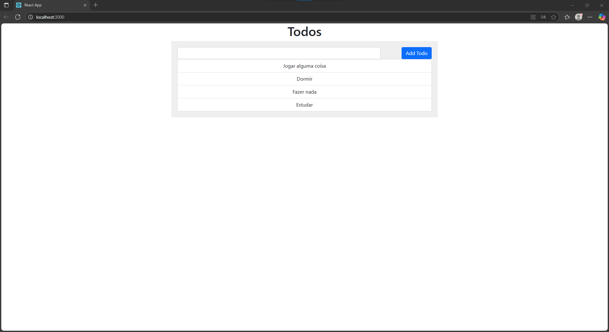
<br>
<br>


## 📁 Exercicio-08: Configurar postgreSQL com Pgadmin

- **Objetivo**: Ultilizar o docker compose  Conectar o postgreSQL com o Pgadmin 

- **Arquivos**: docker-compose.yml

- **Comando**:

Criar arquivo Docker-compose.yml
```dockerfile
services:
  postgres:
    container_name: postgres
    image: postgres:latest
    environment:
      - POSTGRES_USER=${POSTGRES_USER}
      - POSTGRES_PASSWORD=${POSTGRES_PW}
      - POSTGRES_DB=${POSTGRES_DB} #optional (specify default database instead of $POSTGRES_DB)
    ports:
      - "5432:5432"
    restart: always

  pgadmin:
    container_name: pgadmin
    image: dpage/pgadmin4:latest
    environment:
      - PGADMIN_DEFAULT_EMAIL=${PGADMIN_MAIL}
      - PGADMIN_DEFAULT_PASSWORD=${PGADMIN_PW}
    ports:
      - "5050:80"
    restart: always

```
Arquivo .Env para atribuir as informações de login para acessar o banco de dados
```dockerfile
POSTGRES_USER=
POSTGRES_PW=
POSTGRES_DB=
PGADMIN_MAIL=
PGADMIN_PW=
```

Para rodar o arquivo docker-compose no container 
```dockerfile
docker-compose up -d
```

Acesse o Pgadmin no navegador

Abra http://localhost:5050

Login: admin@admin.com

Senha: admin123

Para criar o banco de dados

Object -> create -> Server group

Para conectar o Pgadmin ao PostgreSQL

Menu lateral -> Query Tool Workspace

Container do PostgreSQL e Pgadmin rodando
<br>
<br>
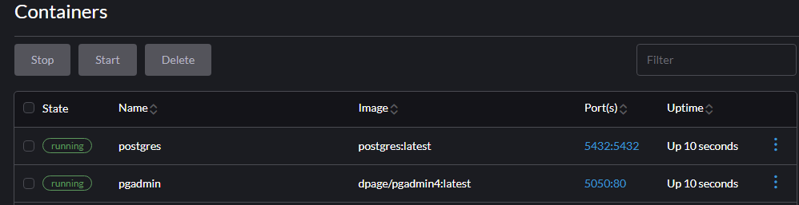
<br>
<br>
Preenchido com as informações do banco de dados, que está no .env, e docker-compose
<br>
<br>
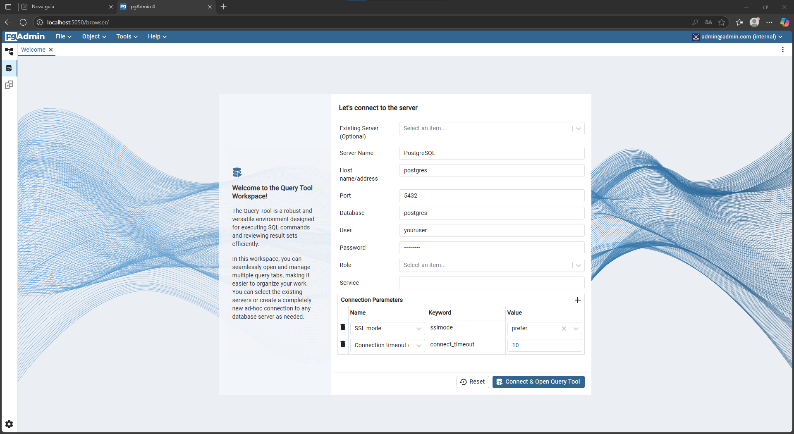
<br>
<br>
Aplicação de banco de dados criada
<br>
<br>
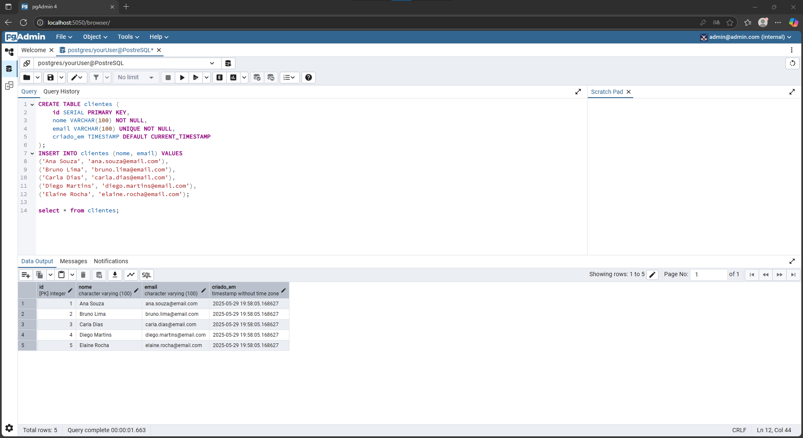
<br>
<br>
Execução do bando de dados no terminal
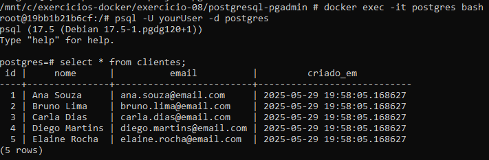
<br>
<br>

## 📁 Exercicio-09: Landing Page com Nginx

- **Objetivo**: baixar um wsite já pronto e hospedar no nginx.

- **Arquivos**: Dockerfile e arquivos do site ja pronto

Dockerfile:

Criar Dockerfile
```dockerfile
FROM nginx:alpine
COPY . /usr/share/nginx/html

```
Criar a imagem e rodar a imagem no container pela porta 80:80
```dockerfile
docker build -t minha-landing .
docker run -d -p 80:80 minha-landing
```
Container da landing page
<br>
<br>
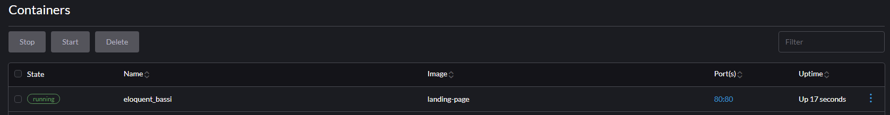
<br>
<br>
Landing Page rodando
<br>
<br>

<br>
<br>

## 📁 Exercicio-10: Executar Container com Usuário Não-Root

- **Objetivo**: Executar uma aplicação Python simples sem utilizar o usuário `root` no container.

- **Comando**:

Criar o script
```dockerfile
import time

while True:
    print("Rodando com usuário não-root...")
    time.sleep(5)

```

Criar o Dockerfile
```dockerfile
FROM python:3.11-slim
WORKDIR /app
COPY app.py .
RUN adduser --disabled-password --gecos '' meuuser
USER meuuser
CMD ["python", "app.py"]

```

Construir a imagem
```dockerfile
docker build -t meu-python-app .
```

Para rodar
```dockerfile
docker run meu-python-app
```

Para verificar o usuário dentro do container
```dockerfile
docker exec -it <container_id> whoami
```
Verificção de usuário
<br>
<br>
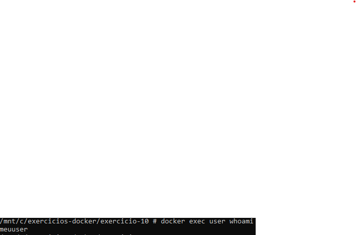
<br>
<br>

## 📁 Exercicio-11: Análise de Vulnerabilidades com Trivy

- **Objetivo**: Verificar as vulnerabilidades da imagem do python:3.9

- **Comandos**:

Instalação de trivy
```dockerfile
sudo apt update
sudo apt install wget -y
wget https://github.com/aquasecurity/trivy/releases/latest/download/trivy_0.51.1_Linux-64bit.deb
sudo dpkg -i trivy_0.51.1_Linux-64bit.deb
```

Verificar as vulnerabilidades
```dockerfile
docker run --rm \
-v /var/run/docker.sock:/var/run/docker.sock \
-v ~/.cache:/root/.cache \
aquasec/trivy image --severity HIGH,CRITICAL python:3.9
```


Filtrar somente as vulnerabilidades HIGH e CRITICAl
```dockerfile
docker run --rm -v /var/run/docker.sock:/var/run/docker.sock -v ~/.cache:/root/.cache aquasec/trivy image --severity HIGH,CRITICAL python:3.9
```
Total de vulnerabildade encontra
<br>
<br>
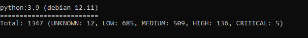
<br>
<br>

## 📁 Exercicio-12: Corrigir a vulnerabilidade do dockerfile

- **Objetivo**: Criar um novo Dockerfile que segue as boas praticas e substuir pelo Dockerfile com más pratica

- **Arquivo**: Dockerfile, app.py, requirements.txt

- **Comandos utilizados**:

Criar Dockerfile seguro
```dockerfile
FROM python:3.11-slim
RUN adduser --disabled-password --gecos '' appuser
WORKDIR /app
COPY requirements.txt .
RUN pip install --no-cache-dir -r requirements.txt
COPY . .
RUN chown -R appuser:appuser /app
USER appuser
EXPOSE 5000
CMD ["python", "app.py"]

```

Arquivo python 
```python
from flask import Flask
app = Flask(__name__)

@app.route("/")
def hello_world():
    return "<p>Hello, World!</p>"

if __name__ == "__main__":
    app.run(host="0.0.0.0", port=5000)

```
Versão do flask
```dockerfile
flask==2.3.3
```
Container já rodando com aplicção segura
<br>
<br>
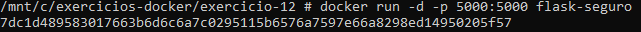
<br>
<br>
Aplicação funcionando 100% e sem vulnerabilidades
<br>
<br>
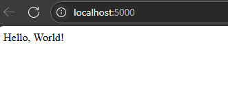
<br>
<br>

## 📁 Exercicio-13: Criar imagem python e publicar no Docker Hub

- **Objetivo**:Criar uma imagem Docker com Python que imprime a data e hora, e publicá-la no Docker Hub.

- **Arquivos**: app.py e Dockerfile

Criar script que impirime o horario atual
```python
from datetime import datetime

print("Data e hora atual:", datetime.now())

```
Criar o Dockerfile:
```dockerfile
FROM python:3.11-slim

WORKDIR /app
COPY app.py .

CMD ["python", "app.py"]
```

Criar a imagem
```dockerfile
docker build -t meu-echo .

```

Entrar na conta do docker hub no terminal
```dockerfile
docker login
```

Alterar o nome da imagem
```dockerfile
docker tag meu-echo sahsz/meu-echo:v1
```

Enviar o repositorio para o Docker Hub
```dockerfile
docker push sahsz/meu-echo:v1
```
Enviando o repositorio para o Docker Hub
<br>
<br>
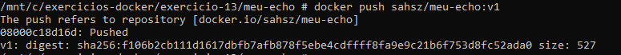
<br>
<br>
Repositorio já disponivel no Docker Hub
<br>
<br>
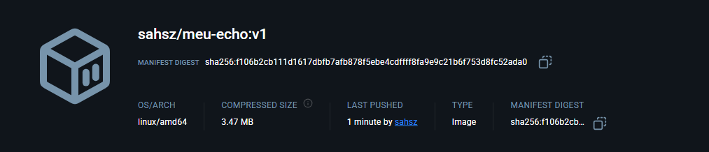
